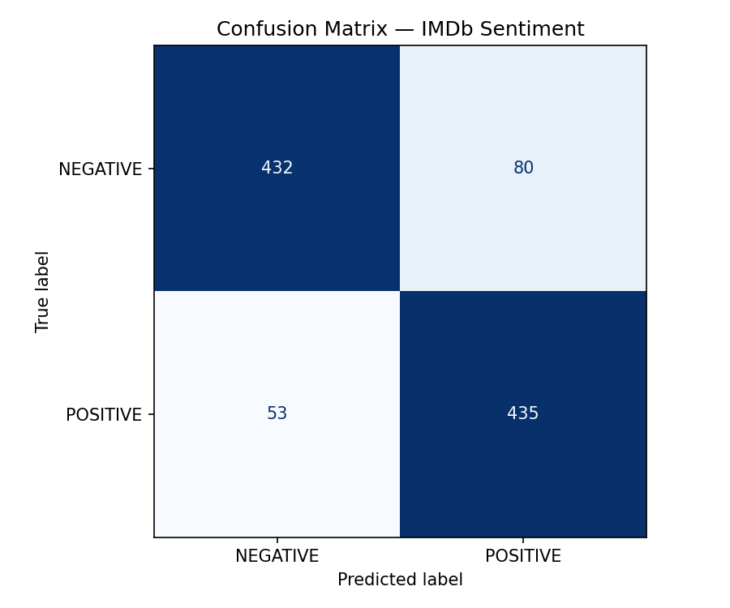
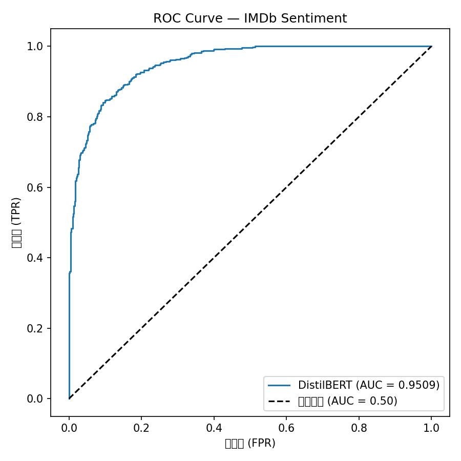

# 01 · Sentiment Analysis with DistilBERT

Fine-tuning a pre-trained Transformer for binary sentiment classification on the IMDb movie review dataset.

---

## Overview

This project uses **transfer learning**: instead of training a language model from scratch (which requires billions of tokens), we take `distilbert-base-uncased` — already pre-trained on a massive text corpus — and fine-tune only its final layers on 25,000 IMDb reviews.

**Final result: 91.15% accuracy, AUC 0.9509**

---

## Files

| File | Description |
|------|-------------|
| `sentiment.py` | Initial training run on 2,000 samples |
| `sentiment_full.py` | Full training on 25,000 samples |
| `evaluate_sentiment.py` | Deep evaluation: confusion matrix, ROC curve, error analysis |
| `demo.py` | Gradio web interface for interactive testing |

---

## Results

### Training Progress

Going from 2,000 → 25,000 training samples:

| | 2k samples | 25k samples |
|--|:-:|:-:|
| Accuracy | 87.0% | **91.15%** |
| Loss (final) | 0.17 | 0.17 |
| Epochs | 3 | 2 |

### Confusion Matrix & ROC Curve

<table>
<tr>
<td></td>
<td></td>
</tr>
</table>

**Confusion matrix breakdown (1000-sample eval):**
- True Negative: 432 · False Positive: 80
- False Negative: 53 · True Positive: 435
- The model is slightly more precise on negatives (89.1%) but slightly better at recalling positives (89.1% recall)

**AUC = 0.9509** — given a random positive and a random negative review, the model correctly ranks the positive one higher 95.1% of the time.

---

## Key Finding: The Sarcasm Problem

The 5 highest-confidence errors (>85% confidence, wrong prediction) were all **sarcasm**:

> *"A truly masterful piece of filmmaking. It managed to put me to sleep."*
> → Model predicted **POSITIVE** with **96.6% confidence**

The model learned that "masterful" is a strong positive signal — but missed the ironic context. This is a known limitation of encoder-only models trained on direct sentiment labels. Solving it requires either more sarcasm-annotated data or a larger model with stronger world knowledge.

---

## How to Run

```bash
# 1. Initial training (fast, 2k samples)
python sentiment.py

# 2. Full training (25k samples, ~15 min on GPU)
python sentiment_full.py

# 3. Deep evaluation
python evaluate_sentiment.py

# 4. Interactive demo
python demo.py
# → opens http://127.0.0.1:7860
```

If HuggingFace is blocked, set the mirror first:
```bash
export HF_ENDPOINT=https://hf-mirror.com
```

---

## Architecture

```
Input text
    ↓
DistilBERT Tokenizer  →  token IDs + attention mask
    ↓
DistilBERT Encoder    →  [CLS] token embedding (768-dim)
(6 Transformer layers,    (pre-trained weights, fine-tuned)
 66M parameters)
    ↓
Linear classifier     →  [negative_score, positive_score]
    ↓
Softmax               →  probability distribution
```

**Why DistilBERT?** It's 40% smaller and 60% faster than BERT-base, retaining 97% of BERT's performance. For a first fine-tuning project, the speed-accuracy tradeoff is ideal.

---

## What Transfer Learning Means in Practice

DistilBERT was pre-trained on BookCorpus + English Wikipedia (~3.3B words) using Masked Language Modeling: randomly mask 15% of tokens, train the model to predict them. After this, the model has learned rich representations of English syntax and semantics.

Fine-tuning adds a single linear layer on top and trains the whole network with a small learning rate (`2e-5`). The pre-trained weights provide a strong starting point — the model doesn't need to relearn English, just adapt its representations to the sentiment task.

This is why 25,000 examples are enough. Training from scratch would require orders of magnitude more data.
