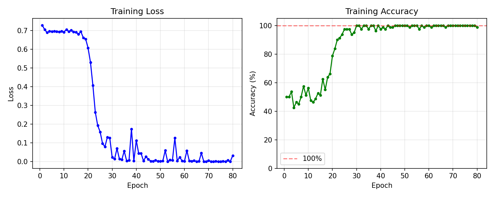
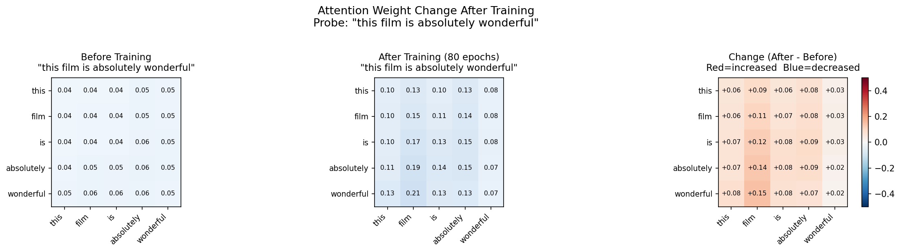
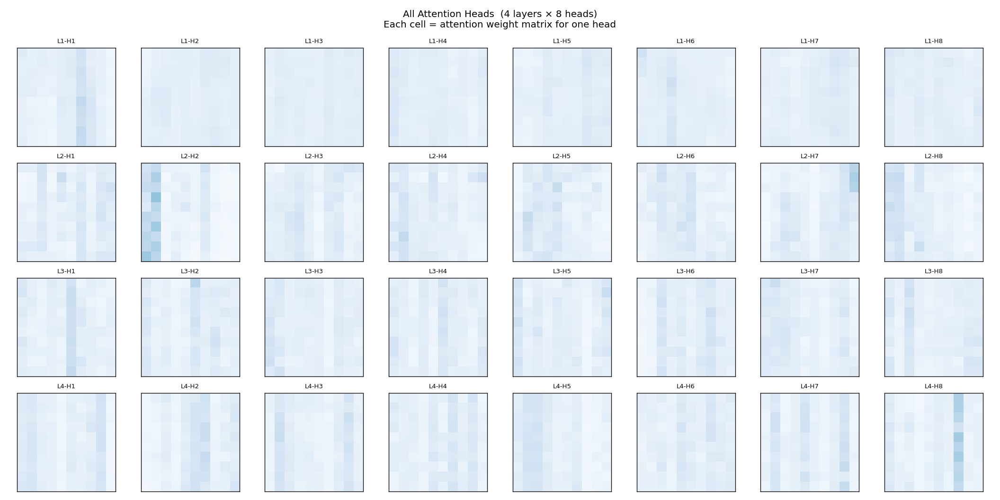
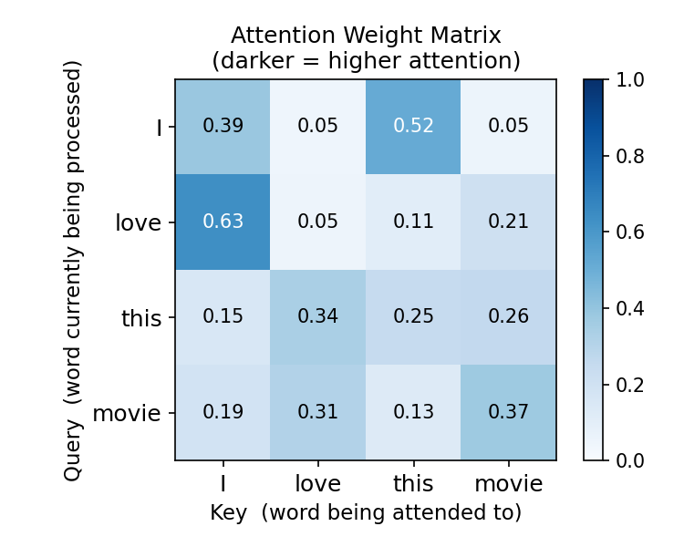

# 02 · Transformer Encoder From Scratch

A complete Transformer Encoder implemented in pure PyTorch — every component written from first principles, no HuggingFace abstractions.

---

## Overview

The goal was to understand *why* Transformers work, not just *how to use* them. Every line of code corresponds to a mathematical operation in the original [Attention Is All You Need](https://arxiv.org/abs/1706.03762) paper.

**Final result:** Loss 0.72 → 0.01 over 80 epochs, training accuracy converged to 100%.

---

## Files

| File | Description |
|------|-------------|
| `transformer_from_scratch.py` | All components: attention, positional encoding, encoder block |
| `train_transformer.py` | Full training loop with visualization of attention change |

---

## Architecture Implemented

```
Input token IDs  [batch, seq_len]
        ↓
Embedding layer  →  [batch, seq_len, d_model=64]
        ↓
Positional Encoding  (sinusoidal, added in-place)
        ↓
┌─── Encoder Block × 2 ──────────────────────────────┐
│                                                      │
│   Multi-Head Attention (4 heads, d_k=16 each)       │
│        ↓                                             │
│   Residual connection + LayerNorm                    │
│        ↓                                             │
│   Feed-Forward Network  (64 → 256 → 64, ReLU)       │
│        ↓                                             │
│   Residual connection + LayerNorm                    │
│                                                      │
└──────────────────────────────────────────────────────┘
        ↓
Mean pooling over sequence
        ↓
Classifier head  (64 → 32 → 2)
        ↓
Softmax  →  [negative, positive]
```

**Total parameters: ~200k** (vs. DistilBERT's 67M — this is intentionally tiny for educational clarity)

---

## Results

### Training Curve



The characteristic **"plateau then cliff"** shape is the warmup signature: the learning rate linearly ramps up for 10 epochs (plateau), then cosine-anneals while the model has found a good gradient direction (cliff descent). Without warmup, the loss stayed at 0.693 (= ln 2, random guessing) for all 30 epochs.

### Attention Weights: Before vs. After Training



Probe sentence: *"this film is absolutely wonderful"*

**Before training:** all weights uniformly ~0.04–0.06 (the model has learned nothing)

**After training:** clear structure emerges:
- `"wonderful" → "film"` increased most (+0.15) — the sentiment adjective learned to anchor to its noun
- `"absolutely" → "film"` increased strongly (+0.14) — the intensifier also anchors to the noun
- `"is" → "film"` increased (+0.12) — the copula connects to its subject

The model independently discovered that **the noun is the semantic anchor of the sentence** — which aligns with how linguists describe predicate-argument structure.

### All 32 Attention Heads (4 layers × 8 heads, initial visualization)



Each cell is a different head's attention matrix. Even in early training, different heads develop visually distinct patterns — some attend broadly, others sharply to one column.

### Single Head Attention (initial)



---

## Key Concepts, Explained

### Why not just use RNNs?

RNNs process tokens sequentially: token 9 only receives information from token 8, which received it from token 7, and so on. Over long sequences, early-token information is diluted by the time it reaches the end. Also, sequential processing can't be parallelized — GPUs are underutilized.

Transformers let every token attend directly to every other token in one step. No information bottleneck. Fully parallel.

### The attention formula

$$\text{Attention}(Q, K, V) = \text{Softmax}\!\left(\frac{QK^T}{\sqrt{d_k}}\right) V$$

- **Q, K, V** are linear projections of the input — each token generates its own query, key, and value vector
- **QKᵀ** computes pairwise similarity scores between all tokens
- **÷√d_k** prevents the scores from becoming too large (which would cause vanishing gradients after softmax)
- **Softmax** normalizes scores to a probability distribution (rows sum to 1)
- **× V** produces a weighted sum of value vectors — the output for each token

### Why divide by √d_k?

When d_k is large, random dot products have variance proportional to d_k. Without scaling, softmax inputs are large, its gradient is near zero, and the network can't learn. Dividing by √d_k keeps the variance at 1 regardless of dimension size.

### Why multiple heads?

A single attention head can only learn one "relationship type" at a time. Multiple heads learn different projections simultaneously — one head might learn syntactic relationships (subject-verb), another semantic ones (noun-modifier). Outputs are concatenated and projected back to d_model.

### Why positional encoding?

Attention is permutation-invariant: "cat eats fish" and "fish eats cat" have the same attention scores if the token embeddings are the same. Sinusoidal positional encoding injects position information by adding a unique vector to each position:

$$PE_{(pos, 2i)} = \sin\!\left(\frac{pos}{10000^{2i/d_{model}}}\right), \quad PE_{(pos, 2i+1)} = \cos\!\left(\frac{pos}{10000^{2i/d_{model}}}\right)$$

The sinusoidal form is chosen because the encoding for position `pos + k` can be expressed as a linear function of position `pos` — this lets the model learn relative positions naturally.

### Why warmup?

At initialization, model weights are random and gradients are unreliable. A high learning rate at this stage causes chaotic updates that can permanently damage the optimization landscape. Warmup linearly increases the learning rate from ~0 over the first N steps, letting the model stabilize before making large updates.

---

## The Most Important Lesson

When training from scratch on 40 sentences without warmup: **loss stuck at 0.693 for 30 epochs** (random chance). Same architecture, same data, with warmup and 80 epochs: **loss fell to 0.01**.

This is why BERT needed 3.3 billion words to pre-train. Transformers are powerful but data-hungry. The breakthrough of BERT/GPT wasn't the architecture — it was the realization that pre-training on massive unlabeled text, then fine-tuning on small labeled datasets, makes the architecture practical.

---

## How to Run

```bash
# Step 1: build components and visualize initial attention
python transformer_from_scratch.py

# Step 2: train and visualize attention change
python train_transformer.py
```

Outputs are saved to `./transformer_logs/`.

No GPU required — CPU training completes in under 2 minutes.
